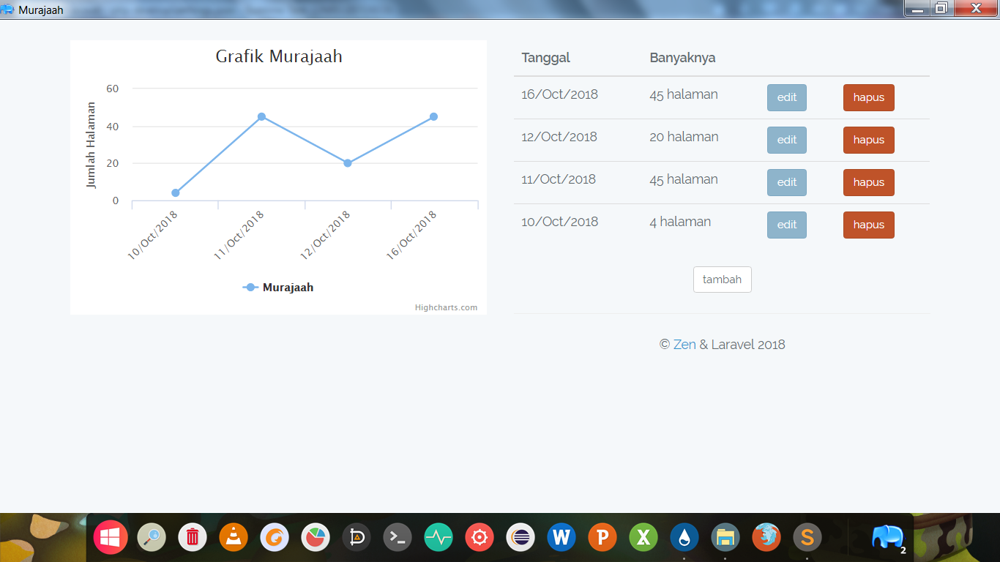

# Instalasi

Buat folder `www/` kemudian salin proyek Laravel ke situ.

Buka `www/.env` kemudian ubah baris berikut:

```
DB_CONNECTION=mysql
DB_HOST=127.0.0.1
DB_PORT=3306
DB_DATABASE=nama_database
DB_USERNAME=username
DB_PASSWORD=password
```

menjadi:

```
DB_CONNECTION=sqlite
```

Install `dependencies/vc_redist.x86.exe`.

Konvert database MySQL menjadi SQLite dengan skrip berikut:

```bash
cd dependencies

./mysql2sqlite.sh  DBNAME --databases DBNAME -u DB_USERNAME -pDB_PASSWORD | sqlite3 database.sqlite
```

Masukkan file-file aplikasi Laravel di `www/`.

Pindahkan `dependencies/database.sqlite` ke `www/database/`.

Buka `www/database/database.sqlite` lalu ubah `id` di masing-masing table menjadi `auto increment`.

Salin `dependencies/index.php` ke `www/`

# Konfigurasi

Edit file `settings.json` sesuai selera.